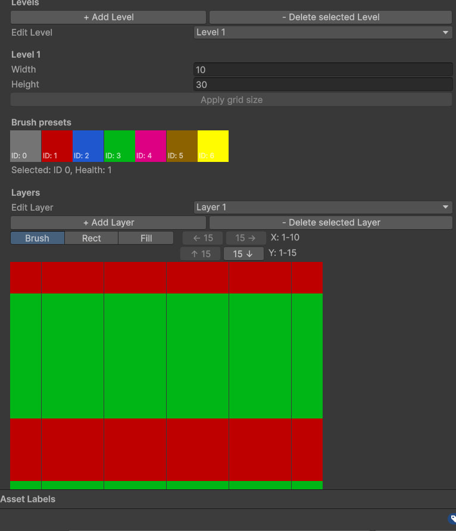

# Color Crush Prototype

https://github.com/user-attachments/assets/e7eb9440-59bd-47ce-a2f3-0160762daec3

**Estimated development time:** ~24 hours

## Architecture

The project structure is based on the **MVC architecture**:

- **Model** contains only data.
- **Controller** handles all game logic.
- **View** is responsible only for rendering elements on the screen.

The main game logic is implemented through **Gameplay States**, which update the required systems depending on the current game state.

The project also contains a **Service layer**, including systems such as:
- Sound
- Pause

Services are implemented as static classes and initialized in **Project Lifescope**. This approach was chosen because these systems represent application-wide logic that can be accessed from different parts of the project.

## Technologies

The project uses:

- **vContainer** — dependency injection management.
- **UniTask** — asynchronous operations.
- **R3** — reactive properties.

## Gameplay

The cube field is represented as a three-dimensional array model, which is updated by `CubesGridMover` inside the Gameplay State.

Level data is stored in `LevelConfig`, which contains:
- Cube grid layout.
- Turret configuration used for destroying cubes.

Levels are created using a custom level editor that allows visual creation of cube patterns.

## Custom Level Editor

## Future Improvements

The current prototype requires further improvements:

- Improve the level editor workflow.
- Implement an algorithm for generating turret patterns based on cube patterns to simplify level creation.

## AI Usage

**Codex** and **ChatGPT** were used for:
- Reviewing algorithms.
- Assisting with the development of the custom level editor.

## External Assets Used
- Hyper Casual Mobile GUI
- The Complete UI Sound Effects Library
